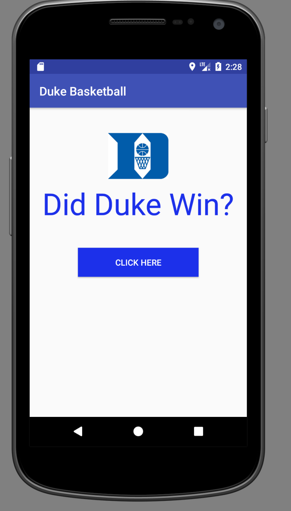
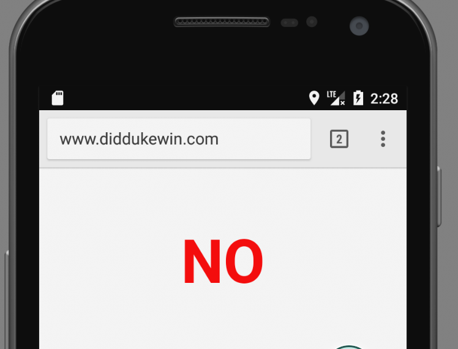

# Simple Duke Basketball Android App
This is a simple android app, made in Android Studio, that when a button is clicked shows the results of the latest Duke Basketball game from the diddukewin.com website.

## Getting Started
Open this project up in android studio. Choose an emulator and an Android SDK 6(marshmellow) or above.

### Prerequisites

```
Android Studio (available for free download online)
```

### How to build 
- select New Project and give it a name and a project location
- One the Target Android Devices screen 
-- choose Phone and Tablet and API 23: Android 6.0 Marshmellow for the minimum SDK 
### Structure 
# /manifests
contains the structure of the activity you are creating
# /java 
contains the functions that allows the app to work 

- Example for getting a button to link to a website
```
 protected void onButtonClick(View view){
            goToUrl ( "http://www.diddukewin.com/");
        }
    private void goToUrl (String url) {
        Uri uriUrl = Uri.parse(url);
        Intent launchBrowser = new Intent(Intent.ACTION_VIEW, uriUrl);
        startActivity(launchBrowser);
    }
```
# /res/drawable
folder contains all jpeg images
- to add to this folder, copy and past image into folder and then choose drawable when asked for a folder directory
# /res/layout 
contains the layouts for the pages of the app (basically the html main)
```
activity_main.xml 
```
- examples of layout formatting for the button controlling the page
```
<Button
        android:layout_width="200dp"
        android:layout_height="wrap_content"
        android:id="@+id/button2"
        android:background="#1c30ea"
        android:text="Click Here"
        android:textColor="#ffffff"
        android:autoLink="web"
        android:cursorVisible="true"
        android:clickable="true"
        android:onClick="onButtonClick"
        android:linksClickable="true"
        android:layout_centerVertical="true"
        android:layout_centerHorizontal="true" />
```
# /res/values
any constant values or strings needed throughout the application(Sass/Less android equivalent)

## Pictures of app 



## Built With

* [Android Studio](https://developer.android.com/studio/index.html) - The web framework used


## Authors

* **Kristen Slappeyn** - *Initial work* - [GitHub](https://github.com/kslap20)

## Acknowledgments

* https://www.tutorialspoint.com/android/android_resources.htm
* https://stackoverflow.com/questions/29047902/how-to-add-an-image-to-the-drawable-folder-in-android-studio

